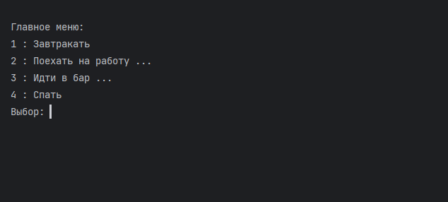

# CliMenu

Simply command line interface menu

Простая библиотека для организации меню в консольном режиме

*Пример:*



Меню описывается списком пунктов. Каждый пункт - кортеж из трех элементов:
1. Индекс. Задает команду выбора пункта меню и иерархию групп. Допускается использовать
Цифры, буквы и даже слова. Для указания подменю используется точка.
2. Название пункта меню.
3. Действие. Callable объект которы будет выполнять при выборе пункта меню.
Для указания группы или возврата на уровень выше - явно указать None.

```python
description = [
        ('1', 'Завтракать', proc1),
        ('2', 'Поехать на работу', None),
        ('3', 'Идти в бар', None),
        ('4', 'Спать', None),
        ('2.1', 'Проверить почту', proc2),
        ('2.4', 'Совещание', proc3),
        ('2.3', 'Обедать', None),
        ('2.2', 'Болтать с коллегой', proc4),
        ('2.5', 'Вернуться домой', None),
        ('2.3.a', 'Пончик', proc5),
        ('2.3.b', 'Кофе', proc6),
        ('2.3.c', 'Конец обеда', None),
        ('3.drink', 'Виски', proc7),
        ('3.eat', 'Салат', proc8),
        ('3.home', 'Домой', None),
    ]
```

Создать меню из описания - *create_menu*. 

Запустить меню - *run_menu* 

```python
cm = create_menu(description, 'Главное меню')
run_menu(cm)
```
